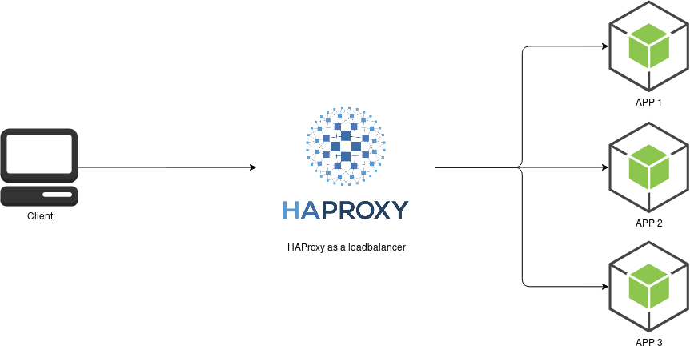

# (3 NodeJS + 1 Load Balancer containers) with Docker Compose

> using HAProxy as the choice of load-balancer.

> node version being used is `14.16.0`

## Usage

1. clone the repo
1. use `docker-compose up` to spin up the containers
1. go to http://localhost:8080

## Diagram

  

## Quick introduction to load balancing and load balancers
Load balancing consists in aggregating multiple components in order to achieve a total processing capacity above each component's individual capacity, without any intervention from the end user and in a scalable way. This results in more operations being performed simultaneously by the time it takes a component to perform only one. A single operation however will still be performed on a single component at a time and will not get faster than without load balancing. It always requires at least as many operations as available components and an efficient load balancing mechanism to make use of all components and to fully benefit from the load balancing. A good example of this is the number of lanes on a highway which allows as many cars to pass during the same time frame without increasing their individual speed.

Examples of load balancing :

  - Process scheduling in multi-processor systems
  - Link load balancing (e.g. EtherChannel, Bonding)
  - IP address load balancing (e.g. ECMP, DNS round-robin)
  - Server load balancing (via load balancers)

The mechanism or component which performs the load balancing operation is called a load balancer. In web environments these components are called a "network load balancer", and more commonly a "load balancer" given that this activity is by far the best known case of load balancing.

A load balancer may act :

  - at the link level : this is called link load balancing, and it consists in choosing what network link to send a packet to.

  - at the network level : this is called network load balancing, and it consists in choosing what route a series of packets will follow.

  - at the server level : this is called server load balancing and it consists in deciding what server will process a connection or request.

Two distinct technologies exist and address different needs, though with some overlapping. In each case it is important to keep in mind that load balancing consists in diverting the traffic from its natural flow and that doing so always requires a minimum of care to maintain the required level of consistency between all routing decisions.

The first one acts at the packet level and processes packets more or less individually. There is a 1-to-1 relation between input and output packets, so it is possible to follow the traffic on both sides of the load balancer using a regular network sniffer. This technology can be very cheap and extremely fast. It is usually implemented in hardware (ASICs) allowing to reach line rate, such as switches doing ECMP. Usually stateless, it can also be stateful (consider the session a packet belongs to and called layer4-LB or L4), may support DSR (direct server return, without passing through the LB again) if the packets were not modified, but provides almost no content awareness. This technology is
very well suited to network-level load balancing, though it is sometimes used for very basic server load balancing at high speed.

The second one acts on session contents. It requires that the input streams is reassembled and processed as a whole. The contents may be modified, and the output stream is segmented into new packets. For this reason it is generally performed by proxies and they're often called layer 7 load balancers or L7. This implies that there are two distinct connections on each side, and that there is no relation between input and output packets sizes nor counts. Clients and servers are not required to use the same protocol (for example IPv4 vs IPv6, clear vs SSL). The operations are always stateful, and the return traffic must pass through the load balancer. The extra processing comes with a cost so it's not always possible to achieve line rate, especially with small packets. On the other hand, it offers wide possibilities and is generally achieved by pure software, even if embedded into hardware appliances. This technology is very well suited for server load balancing.

Packet-based load balancers are generally deployed in cut-through mode, so they are installed on the normal path of the traffic and divert it according to the configuration. The return traffic doesn't necessarily pass through the load balancer. Some modifications may be applied to the network destination address in order to direct the traffic to the proper destination. In this case, it is mandatory that the return traffic passes through the load balancer. If the routes doesn't make this possible, the load balancer may also replace the packets' source address with its own in order to force the return traffic to pass through it.

Proxy-based load balancers are deployed as a server with their own IP addresses and ports, without architecture changes. Sometimes this requires to perform some adaptations to the applications so that clients are properly directed to the load balancer's IP address and not directly to the server's. Some load balancers may have to adjust some servers' responses to make this possible (e.g. the HTTP Location header field used in HTTP redirects). Some proxy-based load balancers may intercept traffic for an address they don't own, and spoof the client's address when connecting to the server. This allows them to be deployed as if they were a regular router or firewall, in a cut-through mode very similar to the packet based load balancers. This is particularly appreciated for products which combine both packet mode and proxy mode. In this case DSR is obviously still not possible and the return traffic still has to be routed back to the load balancer.

A very scalable layered approach would consist in having a front router which receives traffic from multiple load balanced links, and uses ECMP to distribute this traffic to a first layer of multiple stateful packet-based load balancers (L4). These L4 load balancers in turn pass the traffic to an even larger number of proxy-based load balancers (L7), which have to parse the contents to decide what server will ultimately receive the traffic.

The number of components and possible paths for the traffic increases the risk of failure; in very large environments, it is even normal to permanently have a few faulty components being fixed or replaced. Load balancing done without awareness of the whole stack's health significantly degrades availability. For this reason, any sane load balancer will verify that the components it intends to deliver the traffic to are still alive and reachable, and it will stop delivering traffic to faulty ones. This can be achieved using various methods.

The most common one consists in periodically sending probes to ensure the component is still operational. These probes are called "health checks". They must be representative of the type of failure to address. For example a ping- based check will not detect that a web server has crashed and doesn't listen to a port anymore, while a connection to the port will verify this, and a more advanced request may even validate that the server still works and that the database it relies on is still accessible. Health checks often involve a few retries to cover for occasional measuring errors. The period between checks must be small enough to ensure the faulty component is not used for too long after an error occurs.

Other methods consist in sampling the production traffic sent to a destination to observe if it is processed correctly or not, and to evict the components which return inappropriate responses. However this requires to sacrifice a part of the production traffic and this is not always acceptable. A combination of these two mechanisms provides the best of both worlds, with both of them being used to detect a fault, and only health checks to detect the end of the fault. A last method involves centralized reporting : a central monitoring agent periodically updates all load balancers about all components' state. This gives a global view of the infrastructure to all components, though sometimes with less accuracy or responsiveness. It's best suited for environments with many load balancers and many servers.

Layer 7 load balancers also face another challenge known as stickiness or persistence. The principle is that they generally have to direct multiple subsequent requests or connections from a same origin (such as an end user) to the same target. The best known example is the shopping cart on an online store. If each click leads to a new connection, the user must always be sent to the server which holds his shopping cart. Content-awareness makes it easier to spot some elements in the request to identify the server to deliver it to, but that's not always enough. For example if the source address is used as a key to pick a server, it can be decided that a hash-based algorithm will be used and that a given IP address will always be sent to the same server based on a divide of the address by the number of available servers. But if one server fails, the result changes and all users are suddenly sent to a different server and lose their shopping cart. The solution against this issue consists in memorizing the chosen target so that each time the same visitor is seen, he's directed to the same server regardless of the number of available servers. The information may be stored in the load balancer's memory, in which case it may have to be replicated to other load balancers if it's not alone, or it may be stored in the client's memory using various methods provided that the client is able to present this information back with every request (cookie insertion, redirection to a sub-domain, etc). This mechanism provides the extra benefit of not having to rely on unstable or unevenly distributed information (such as the source IP address). This is in fact the strongest reason to adopt a layer 7 load balancer instead of a layer 4 one.

In order to extract information such as a cookie, a host header field, a URL or whatever, a load balancer may need to decrypt SSL/TLS traffic and even possibly to re-encrypt it when passing it to the server. This expensive task explains why in some high-traffic infrastructures, sometimes there may be a lot of load balancers.

Since a layer 7 load balancer may perform a number of complex operations on the traffic (decrypt, parse, modify, match cookies, decide what server to send to, etc), it can definitely cause some trouble and will very commonly be accused of being responsible for a lot of trouble that it only revealed. Often it will be discovered that servers are unstable and periodically go up and down, or for web servers, that they deliver pages with some hard-coded links forcing the clients to connect directly to one specific server without passing via the load balancer, or that they take ages to respond under high load causing timeouts. That's why logging is an extremely important aspect of layer 7 load balancing. Once a trouble is reported, it is important to figure if the load balancer took a wrong decision and if so why so that it doesn't happen anymore.

## Introduction to HAProxy
HAProxy is written as "HAProxy" to designate the product, and as "haproxy" to designate the executable program, software package or a process. However, both are commonly used for both purposes, and are pronounced H-A-Proxy. Very early, "haproxy" used to stand for "high availability proxy" and the name was written in two separate words, though by now it means nothing else than "HAProxy".

### What HAProxy is and isn't

HAProxy is :

  - a TCP proxy : it can accept a TCP connection from a listening socket, connect to a server and attach these sockets together allowing traffic to flow in both directions; IPv4, IPv6 and even UNIX sockets are supported on either side, so this can provide an easy way to translate addresses between different families.

  - an HTTP reverse-proxy (called a "gateway" in HTTP terminology) : it presents itself as a server, receives HTTP requests over connections accepted on a listening TCP socket, and passes the requests from these connections to servers using different connections. It may use any combination of HTTP/1.x or HTTP/2 on any side and will even automatically detect the protocol spoken on each side when ALPN is used over TLS.

  - an SSL terminator / initiator / offloader : SSL/TLS may be used on the connection coming from the client, on the connection going to the server, or even on both connections. A lot of settings can be applied per name (SNI), and may be updated at runtime without restarting. Such setups are extremely scalable and deployments involving tens to hundreds of thousands of certificates were reported.

  - a TCP normalizer : since connections are locally terminated by the operating system, there is no relation between both sides, so abnormal traffic such as invalid packets, flag combinations, window advertisements, sequence numbers, incomplete connections (SYN floods), or so will not be passed to the other side. This protects fragile TCP stacks from protocol attacks, and also allows to optimize the connection parameters with the client without having to modify the servers' TCP stack settings.

  - an HTTP normalizer : when configured to process HTTP traffic, only valid complete requests are passed. This protects against a lot of protocol-based attacks. Additionally, protocol deviations for which there is a tolerance in the specification are fixed so that they don't cause problem on the servers (e.g. multiple-line headers).

  - an HTTP fixing tool : it can modify / fix / add / remove / rewrite the URL or any request or response header. This helps fixing interoperability issues in complex environments.

  - a content-based switch : it can consider any element from the request to decide what server to pass the request or connection to. Thus it is possible to handle multiple protocols over a same port (e.g. HTTP, HTTPS, SSH).

  - a server load balancer : it can load balance TCP connections and HTTP requests. In TCP mode, load balancing decisions are taken for the whole connection. In HTTP mode, decisions are taken per request.

  - a traffic regulator : it can apply some rate limiting at various points, protect the servers against overloading, adjust traffic priorities based on the contents, and even pass such information to lower layers and outer network components by marking packets.

  - a protection against DDoS and service abuse : it can maintain a wide number of statistics per IP address, URL, cookie, etc and detect when an abuse is happening, then take action (slow down the offenders, block them, send them to outdated contents, etc).

  - an observation point for network troubleshooting : due to the precision of the information reported in logs, it is often used to narrow down some network-related issues.

  - an HTTP compression offloader : it can compress responses which were not compressed by the server, thus reducing the page load time for clients with poor connectivity or using high-latency, mobile networks.

  - a caching proxy : it may cache responses in RAM so that subsequent requests for the same object avoid the cost of another network transfer from the server as long as the object remains present and valid. It will however not store objects to any persistent storage. Please note that this caching feature is designed to be maintenance free and focuses solely on saving haproxy's precious resources and not on save the server's resources. Caches designed to optimize servers require much more tuning and flexibility. If you instead need such an advanced cache, please use Varnish Cache, which integrates perfectly with haproxy, especially when SSL/TLS is needed on any side.

  - a FastCGI gateway : FastCGI can be seen as a different representation of HTTP, and as such, HAProxy can directly load-balance a farm comprising any combination of FastCGI application servers without requiring to insert another level of gateway between them. This results in resource savings and a reduction of maintenance costs.

HAProxy is not :

  - an explicit HTTP proxy, i.e. the proxy that browsers use to reach the internet. There are excellent open-source software dedicated for this task, such as Squid. However HAProxy can be installed in front of such a proxy to provide load balancing and high availability.

  - a data scrubber : it will not modify the body of requests nor responses.

  - a static web server : during startup, it isolates itself inside a chroot jail and drops its privileges, so that it will not perform any single file- system access once started. As such it cannot be turned into a static web server (dynamic servers are supported through FastCGI however). There are excellent open-source software for this such as Apache or Nginx, and HAProxy can be easily installed in front of them to provide load balancing, high availability and acceleration.

  - a packet-based load balancer : it will not see IP packets nor UDP datagrams, will not perform NAT or even less DSR. These are tasks for lower layers. Some kernel-based components such as IPVS (Linux Virtual Server) already do this pretty well and complement perfectly with HAProxy.
